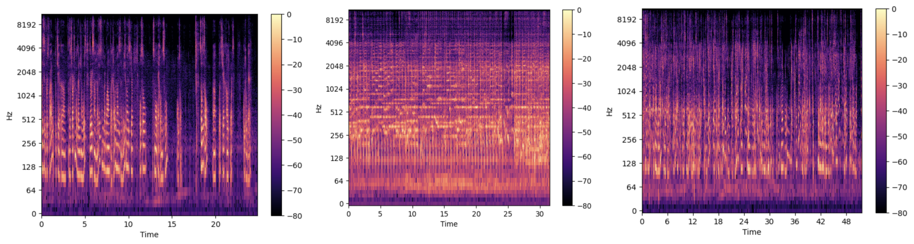
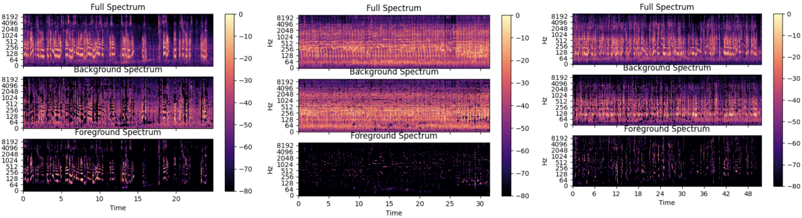
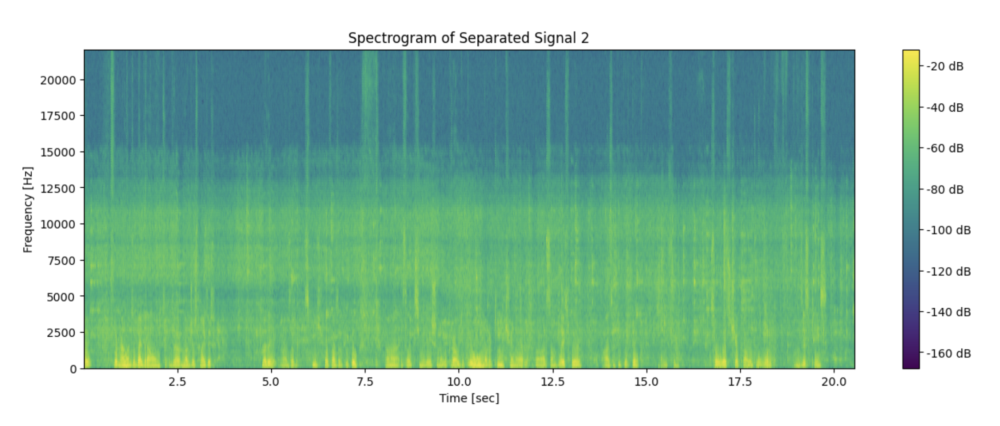

# vocals-noise.separation

Here is a small research project for cleaned vocals/background noise extraction from a video file.

Since developing an ideal solution for any type of audio would be too complicated, while using a ready-made end-to-end solution is not so interesting, we will concentrate on improving the case of polyphonic noise.

Full run can be found here [master_notebook](master_nodebook.ipynb).

## Problem Statement

    Input: Avideofile (e.g., MP4format).
    Output: Two separate audio tracks:
        Track1: Cleaned vocals(as much as possible).
        Track2: Background noises.

## 0. Data

For benchmarking we will use 3 different types of input videofiles:

- voice + simple background (echo and some noise)
- voice + instruments (music video)(ziped by github, can be taken here https://clck.ru/36hAAp)
- voice + voises on the background (crowded room simulation)

In terms of futher Speech-to-text the last file seems to be the most challenging, because the noise is also a clear speech.

Raw videofiles can be found here [link](data/raw/video/).

## 1. Baseline

### 1.1 Model and metrics

 At the beginning let's implement simple nearest neighbour filter [1].

 Transform the signal from time to frequency domain, then filter using nearest neighbors. 

$D = S \cdot e^{jP},\ \  S_{\text{filter}} = \min(S, \text{NN}(S))$

Create masks to isolate vocals ->  Apply masks to the spectrogram -> Convert back to time domain for audio signals.

To measure the quality of extraction we will use:
- Signal-to-Noise Ratio: $SNR(dB) = 10\cdot log_{10}(P_{\text{signal}}/P_{\text{noise}})$
- Word Error Rate witch calculates the number of substitutions (S), insertions (I), and deletions (D) needed to transform one into the other, divided by the number of words in the reference (N): $WER = (S+I+D)/N$

To calculate WER, pretraind Hugging Face transformer will be used to make hypothesis on extracted audio files. [2]

### 1.2 Result

 Spectrums for simple, music and crowd background:

 

 Separate spectrums for simple, music and crowd background:

 

As we can see music and crowd cases are much more challenging for our baseline model.

Since, both scenarios are challenging, but crowded noise environments are often more problematic for speech recognition systems because the noise is less predictable and can vary widely in frequency and intensity, which adversely affects both WER and SNR. Music, while also challenging, often has a more predictable structure that may be easier to model and mitigate in some systems.

The performance metrics also confirms our initial hypothesis:

|         | simple   | music    | crowd    |
|---------|----------|----------|----------|
| SNR     | -5.84    | -14.05   | -7.97    |
| WER     |    0.67  |  0.93    |  0.94    |

Plots can be found here [link](report/).

## 2. Advanced model

### 2.1 The "Cocktail Party Algorithm"

The Cocktail Party Algorithm refers to the problem of separating a set of mixed signals into their individual components. This problem is analogous to distinguishing individual voices in a noisy environment, like a cocktail party. [3], [4]

#### It is pretty advanced algorithm let's implement here it's easier version [5]

Independent Component Analysis (ICA) is employed for solving this problem. The algorithm seeks to decompose a multi-dimensional signal into independent non-Gaussian signals.

Given a mixed signal $\mathbf{x}$, the process involves the following steps:

- Centering: Subtract the mean from $\mathbf{x}$ to center it. $$\mathbf{x}_{centered} = \mathbf{x} - \mathbb{E}[\mathbf{x}]$$
- Whitening: Transform $\mathbf{x}$ to ensure components are uncorrelated and have unit variance. $$\mathbf{x}_{whitened} = \mathbf{E}\mathbf{D}^{-\frac{1}{2}}\mathbf{E}^T\mathbf{x} $$
- Applying ICA: Estimate the independent components from the whitened data.
$$\mathbf{s} = \mathbf{Wx} \$$

where $\mathbf{W}$ is the unmixing matrix estimated by the ICA algorithm.

The implementation of the Cocktail Party Algorithm using ICA provides an effective method for signal separation in complex auditory environments.

The performance metrics for crowd noise also upgraded:

|         | baseline |cocktail  |
|---------|----------|----------|
| SNR     | -7.97    | 0.07     |
| WER     |    0.94  |    0.78  |

Spectrogram for each separated component:

Realization can be found here [link](src/cocktail.py).

### 2.2 Fine tuning

Another way is to fine tune pretrained models on similar datasets, but is is quet specific for each noise environment.

For example we use pre-trained deep learning model for audio source separation developed called spleeter: [6]

|         | baseline |cocktail  |spleeter  |
|---------|----------|----------|----------|
| SNR     | -7.97    | 0.07     |18.35     |
| WER     |    0.94  |    0.78  |    0.67  |

## 3. Futher implementation

To create an effective speech-to-text pipeline, integrate audio separation tools like Spleeter, aligning with a larger workflow we need to tune all modules in the solution (separation, speech recognition, language models, ...) to reach the quality tresholds and not be over comlicated and demanding. 

So, basically it was shown that both classical DSP and DL approaches can be helpful. Since, DL approach looks much more stronger potentially. And the key problems I see are: fine tuning to particular noise type and computational requirements (may be problem for real-time product). Here as I believe hybrid model (DSP+DL) and some approaches like transfer learning may be suitable.

## Structure

    .                          
    ├── data
    │   ├── raw                     # Raw data files
    │   ├── voices                  # Extracted voices
    │   └── background              # Extracted background (noise)
    │
    ├── master_notebook             # Research run
    ├── models                      # Trained models
    ├── report                      # Plots and text report
    ├── standalone_model            # MossFormer2
    │
    └──src
        ├── cocktail.py             # Realisation of ICA
        ├── extract_audio.py        # Writing audiotrack from videofile
        ├── SNR.py                  # Signal to noise calculation
        └── WER.py                  # Word error rate calculation

## Reference

[1] Vicente G. Reyes - Separate vocals from a track using python (<https://clck.ru/36gjFP>)

[2] Hugging Face - Automatic speech recognition with a pipeline (<https://clck.ru/36gwtv>)

[3] Deep Learning Machine Solves the Cocktail Party Problem (<https://clck.ru/36gjQe>)

[4] Andrew J.R. Simpson, Gerard Roma, Mark D. Plumbley - Deep Karaoke: Extracting Vocals from Musical Mixtures Using a Convolutional Deep Neural Network (<http://arxiv.org/abs/1504.04658>)

[5] Gowri Shankar - Blind Source Separation using ICA - A Practical Guide to Separate Audio Signals (<https://clck.ru/36h2Rs>)

[6] Deezer Research - Spleeter (<https://clck.ru/36h7p2>)
